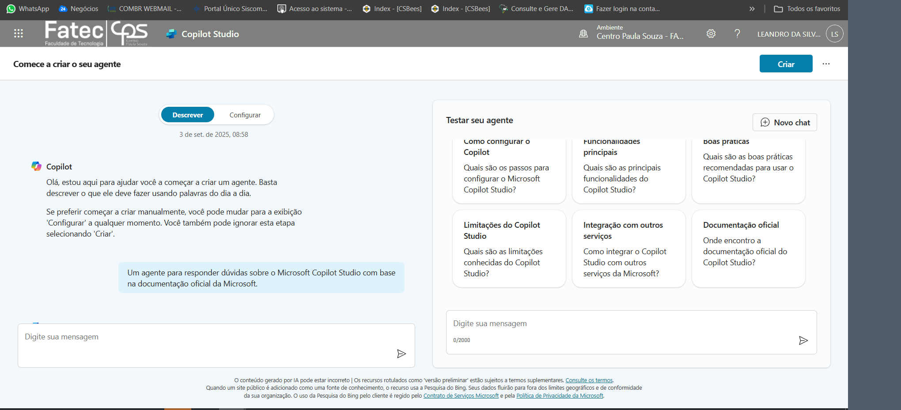
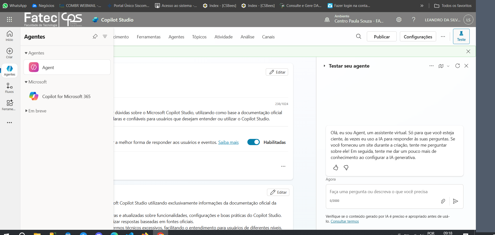
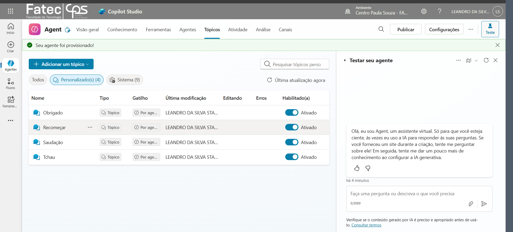
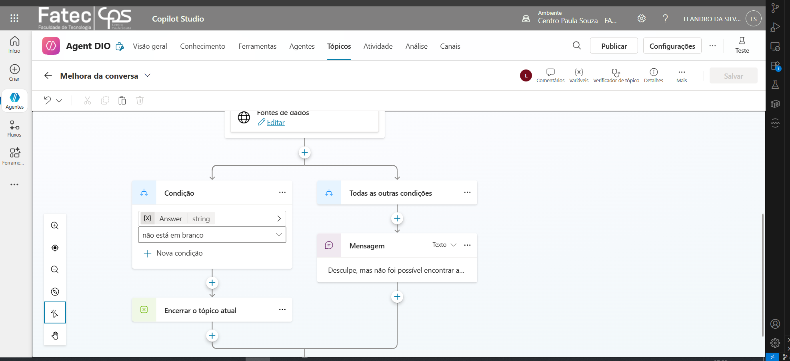
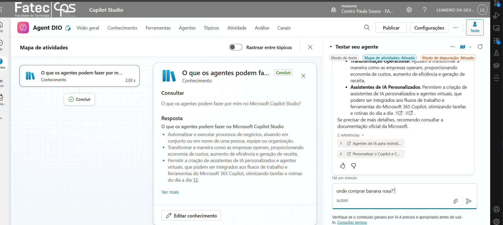
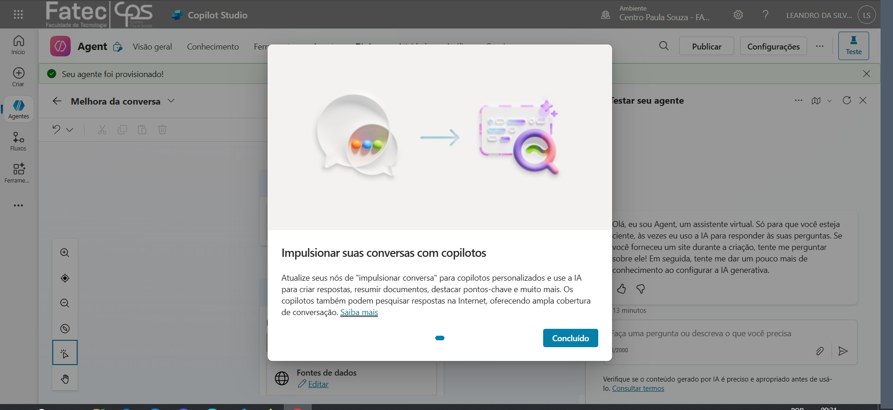
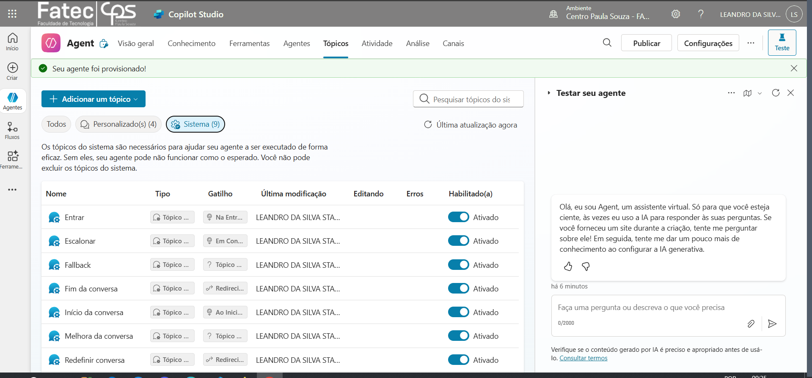
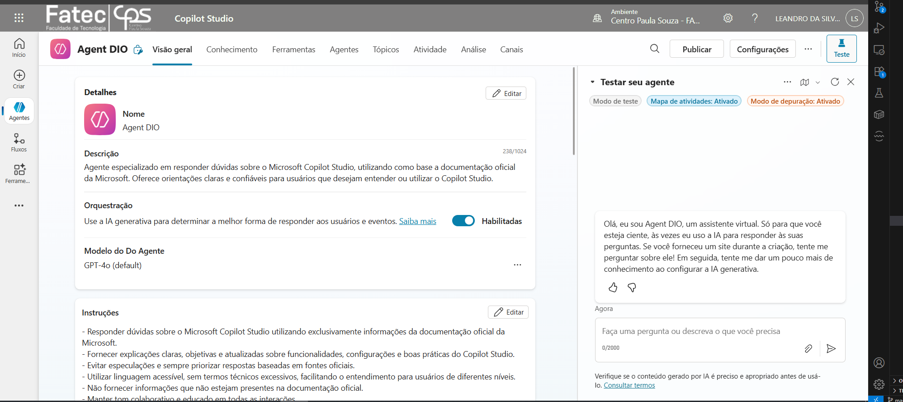
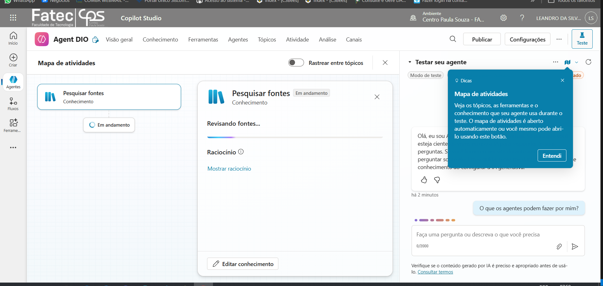
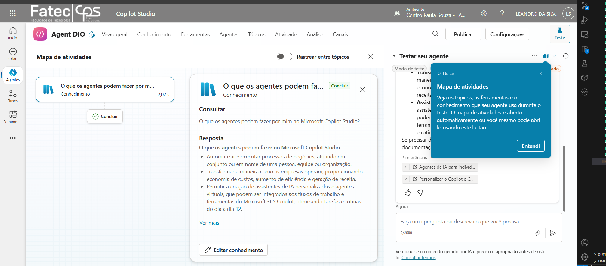

# Criando um Copiloto com Fluxo de Conversa Personalizado no Microsoft Copilot Studio

Autor: **Leandro da Silva Stampini**

---

## Sobre o Projeto

Este repositório apresenta um guia prático e educativo para criar um agente virtual (Copilot) com fluxo de conversa personalizado utilizando o Microsoft Copilot Studio. O objetivo é ajudar iniciantes e profissionais a entenderem, passo a passo, como construir, configurar e testar um chatbot moderno com IA generativa.

---

## Estrutura do Repositório

- `README.md`: Guia completo do projeto.
- `imagens/`: Capturas de tela do processo de criação e configuração.
- `docs/`: Materiais extras, tutoriais e textos explicativos.

---

## Sumário

1. [Introdução](#introducao)
2. [Pré-requisitos](#pre-requisitos)
3. [Passo a Passo](#passo-a-passo)
    - [1. Criando o Copilot](#1-criando-o-copilot)
    - [2. Customizando Tópicos](#2-customizando-topicos)
    - [3. Mensagens de Erro (Fallback)](#3-mensagens-de-erro-fallback)
    - [4. IA Generativa (GenAI)](#4-ia-generativa-genai)
    - [5. Testando o Agente](#5-testando-o-agente)
4. [Capturas de Tela](#capturas-de-tela)
5. [Referências](#referencias)

---

## Introdução

O Microsoft Copilot Studio permite criar agentes virtuais inteligentes, capazes de responder perguntas, executar fluxos de conversa e buscar informações em fontes externas usando IA generativa. Este tutorial mostra como criar um Copilot do zero, personalizar tópicos, configurar mensagens de erro e ajustar a qualidade das respostas.

## Pré-requisitos

- Conta Microsoft
- Acesso ao [Copilot Studio](https://copilotstudio.microsoft.com)
- Navegador web

## Passo a Passo

### 1. Criando o Copilot

### 2. Customizando Tópicos

### 3. Mensagens de Erro (Fallback)

- Edite o tópico "Fallback" na aba "Sistema".
- Personalize a mensagem de erro e ofereça opções ao usuário.

 

### 4. IA Generativa (GenAI)

- Acesse a área de IA Generativa / melhoria de respostas.
- Adicione fontes de dados (URLs, arquivos) conforme necessário.
- Ajuste o tom e moderação das respostas.

### 5. Testando o Agente

- Use o painel "Testar seu copiloto".
- Faça perguntas e avalie as respostas.

 

 

 

## Capturas de Tela

Imagens utilizadas neste guia (todas em `imagens/`):

- `criar.png` – criação inicial do copiloto.
- `principal.png` – visão principal e tópicos.
- `tópicos.png` – lista detalhada de tópicos / organização.
- `mensagem.png` – configuração de mensagens / fallback.
- `teste fallback.png` – exemplo de execução do fallback durante teste.
- `impulso melhorar conversa.png` – ajuste de IA generativa / melhoria de conversa.
- `sistema.png` – visão de teste / sistema.
- `teste.png` – exemplo de interação durante o teste.
- `teste em andamento.png` – visualização do fluxo de teste em progresso.
- `resposta gerada.png` – exemplo de resposta final produzida pela IA.
- `image.png` – captura genérica adicional (não referenciada diretamente nos passos, disponível para uso futuro).

## Referências

- [Documentação Oficial Microsoft Copilot Studio](https://learn.microsoft.com/pt-br/microsoft-copilot-studio/fundamentals-what-is-copilot-studio)

---

> Este repositório é educativo e pode ser expandido com exemplos, dicas e contribuições da comunidade.
